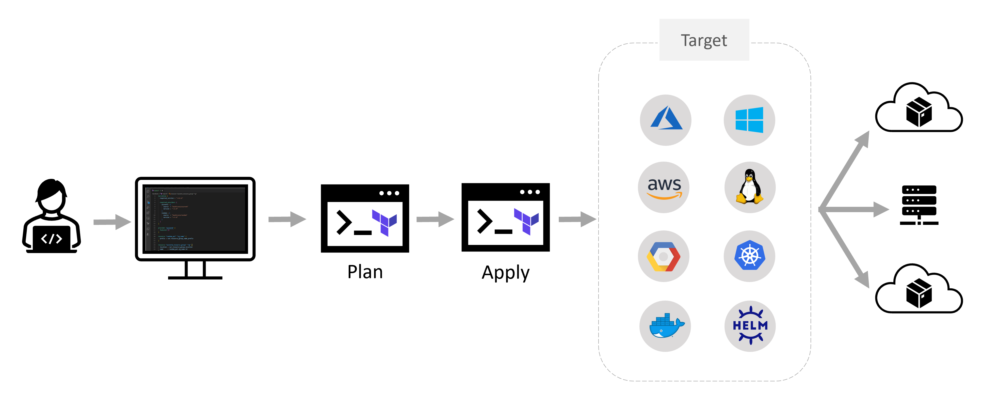

# Infrastructure as Code (IaC)

Infrastructure as code (IaC) uses DevOps methodology and versioning with a descriptive model to define and deploy infrastructure, such as networks, virtual machines, load balancers, and connection topologies. Just as the same source code always generates the same binary, an IaC model generates the same environment every time it deploys.

IaC evolved to solve the problem of environment drift in release pipelines. Without IaC, teams must maintain deployment environment settings individually. Over time, each environment becomes a "snowflake," a unique configuration that can't be reproduced automatically. Inconsistency among environments can cause deployment issues. Infrastructure administration and maintenance involve manual processes that are error prone and hard to track.

> IaC allows you to build, change, and manage your infrastructure in a safe, consistent, and repeatable way by defining resource configurations that you can version, reuse, and share.

## Use declarative definition files

IaC should use declarative definition files if possible. A definition file describes the **components and configuration that an environment requires**, but not necessarily how to achieve that configuration. For example, the file might define a required server version and configuration, but not specify the server installation and configuration process. This abstraction allows for greater flexibility to use optimized techniques the infrastructure provider supplies. Declarative definitions also help reduce the technical debt of maintaining imperative code, such as deployment scripts, that can accrue over time.

There's no standard syntax for declarative IaC. The syntax for describing IaC usually depends on the requirements of the target platform. Different platforms support file formats such as YAML, JSON, and XML.


## Why Insfrastructure as Code?

- Stand up environments in the fastest means possible. Teams can provision multiple test environments reliably on demand.
- Avoid configuration drift. Remove the human element and reliably and repeatable deploy every time. 
- Improve environment visibility and improve developer efficiency.
- Store your infrastructure definitions alongside with your application code. Use Version Control Systems (VCSs) like GitHub, Azure DevOps, and others.

## Deploy IaC on Azure
Azure provides native support for IaC via the Azure Resource Manager model. Teams can define declarative ARM templates that specify the infrastructure required to deploy solutions.

Third-party platforms like **Terraform**, Ansible, Chef, and Pulumi also support IaC to manage automated infrastructure.


# Terraform


Terraform is HashiCorp's infrastructure as code tool. It lets you define resources and infrastructure in human-readable, declarative configuration files, and manages your infrastructure's lifecycle. Using Terraform has several advantages over manually managing your infrastructure:

- Terraform can manage infrastructure on multiple cloud platforms.
- The human-readable configuration language helps you write infrastructure code quickly.
- Terraform's state allows you to track resource changes throughout your deployments.
- You can commit your configurations to version control to safely collaborate on infrastructure.

## Manage any infrastructure
Terraform plugins called **providers** let Terraform interact with cloud platforms and other services via their application programming interfaces (APIs). HashiCorp and the Terraform community have written over 1,000 providers to manage resources on Azure, Amazon Web Services (AWS), Google Cloud Platform (GCP), Kubernetes, Helm, GitHub, Azure DevOps, and many others. Find providers for many of the platforms and services you already use in the [Terraform Registry](https://registry.terraform.io/browse/providers). If you don't find the provider you're looking for, you can write your own.

Providers define individual units of infrastructure, for example compute instances or private networks, as resources. You can compose resources from different providers into reusable Terraform configurations called modules, and manage them with a consistent language and workflow.

> **_NOTE:_** To learn how to install Terraform see [here](https://learn.hashicorp.com/tutorials/terraform/install-cli?in=terraform/azure-get-started#install-terraform).

## Terraform Deployment Workflow

Terraform's configuration language describes the desired end-state for your infrastructure, in contrast to procedural programming languages that require step-by-step instructions to perform tasks. Terraform providers automatically calculate dependencies between resources to create or destroy them in the correct order.



To deploy infrastructure with Terraform:

- **Scope** - Identify the infrastructure for your project.
- **Author** - Write the configuration for your infrastructure.
- **Initialize** - Install the plugins Terraform needs to manage the infrastructure.
- **Plan** - Preview the changes Terraform will make to match your configuration.
- **Apply** - Make the planned changes.

Terraform keeps track of your real infrastructure in a **state file**, which **acts as a source of truth** for your environment. Terraform uses the state file to determine the changes to make to your infrastructure so that it will match your configuration.

## Terraform State File
Terraform must store state about your managed infrastructure and configuration. This state is used by Terraform to map real world resources to your configuration, keep track of metadata, and to improve performance for large infrastructures.

This state is stored by default in a local file named "terraform.tfstate", but it can also be stored remotely, which works better in a team environment.

The primary purpose of Terraform state is to store bindings between objects in a remote system and resource instances declared in your configuration. When Terraform creates a remote object in response to a change of configuration, it will record the identity of that remote object against a particular resource instance, and then potentially update or delete that object in response to future configuration changes.

While the format of the state files are just JSON, direct file editing of the state is discouraged. Terraform provides the terraform state command to perform basic modifications of the state using the CLI.

### Remote State File
By default, Terraform stores state locally in a file named terraform.tfstate. When working with Terraform in a team, use of a local file makes Terraform usage complicated because each user must make sure they always have the latest state data before running Terraform and make sure that nobody else runs Terraform at the same time.

With remote state, Terraform writes the state data to a remote data store, which can then be shared between all members of a team. Terraform supports storing state in Terraform Cloud, HashiCorp Consul, **Azure Blob Storage**, Amazon S3, Google Cloud Storage, and more.

### Sensitive Data
Terraform state can contain sensitive data, depending on the resources in use and your definition of "sensitive." The state contains resource IDs and all resource attributes. For resources such as databases, this may contain initial passwords.

When using local state, state is stored in plain-text JSON files.

When using remote state, state is only ever held in memory when used by Terraform. It may be encrypted at rest, but this depends on the specific remote state backend.

### Import Existing Resources 
Terraform can import existing infrastructure resources. This functionality allows you take resources you created by some other means and bring them under Terraform management.

> **_NOTE:_** The terraform import command can only import one resource at a time. 


## Terraform Configuration Language

The main purpose of the Terraform language is declaring resources, which represent infrastructure objects. All other language features exist only to make the definition of resources more flexible and convenient. Each resource block describes one or more infrastructure objects, such as virtual networks, compute instances, or higher-level components such as DNS records.

```terraform
<BLOCK TYPE> "<BLOCK LABEL>" "<BLOCK LABEL>" {
  # Block body
  <IDENTIFIER> = <EXPRESSION> # Argument
}
```

- **Blocks** are containers for other content and usually represent the configuration of some kind of object, like a resource. Blocks have a block type, can have zero or more labels, and have a body that contains any number of arguments and nested blocks. Most of Terraform's features are controlled by top-level blocks in a configuration file.
- **Arguments** assign a value to a name. They appear within blocks.
- **Expressions** represent a value, either literally or by referencing and combining other values. They appear as values for arguments, or within other expressions.

## Resources 

Resource declarations can include a number of advanced features, but only a small subset are required for initial use. More advanced syntax features, such as single resource declarations that produce multiple similar remote objects, are described later in this page.

```terraform
resource "azurerm_resource_group" "my" {
  name     = "myResourceGroup"
  location = "southcentralus"
}
```

A **resource block** declares a resource of a given type ("azurerm_resource_group") with a given local name ("my"). The name is used to refer to this resource from elsewhere in the same Terraform module, but has no significance outside that module's scope. The resource type and name together serve as an identifier for a given resource and so must be unique within a module.

Within the block body (between **{** and **}**) are the configuration arguments for the resource itself. Most arguments in this section depend on the resource type, and indeed in this example both name and location are arguments defined specifically for the [azurerm_resource_group](https://registry.terraform.io/providers/hashicorp/azurerm/latest/docs/resources/resource_group) resource type.


## Data Sources
Data sources allow Terraform to use information defined outside of Terraform, defined by another separate Terraform configuration, or modified by functions.

```terraform
data "azurerm_resource_group" "myRG" {
  name     = "existingRG"
}
```

A data block requests that Terraform read from a given data source ("azurerm_resource_group") and export the result under the given local name ("myRG"). The name is used to refer to this resource from elsewhere in the same Terraform module, but has no significance outside of the scope of a module.

The data source and name together serve as an identifier for a given resource and so must be unique within a module.

Within the block body (between **{** and **}**) are query constraints defined by the data source. Most arguments in this section depend on the data source, and indeed in this example most_recent, owners and tags are all arguments defined specifically for the [azurerm_resource_group](https://registry.terraform.io/providers/hashicorp/azurerm/latest/docs/data-sources/resource_group) data source.


## Providers
Terraform relies on plugins called providers to interact with cloud providers, SaaS providers, and other APIs.

Each provider adds a set of resource types and/or data sources that Terraform can manage. Every resource type is implemented by a provider; without providers, Terraform can't manage any kind of infrastructure.

Most providers configure a specific infrastructure platform (either cloud or self-hosted). Providers can also offer local utilities for tasks like generating random numbers for unique resource names.


The [Terraform Registry](https://registry.terraform.io/browse/providers) is the main directory of publicly available Terraform providers, and hosts providers for most major infrastructure platforms.

Additionally, some providers require configuration (like endpoint URLs or cloud regions) before they can be used. The Provider Configuration page documents how to configure settings for providers.

```terraform
# We strongly recommend using the required_providers block to set the
# Azure Provider source and version being used
terraform {
  required_providers {
    azurerm = {
      source  = "hashicorp/azurerm"
      version = "=3.0.0"
    }
  }
}

# Configure the Microsoft Azure Provider
provider "azurerm" {
  features {}
}

# Create a resource group
resource "azurerm_resource_group" "example" {
  name     = "example-resources"
  location = "West Europe"
}
```

> **_NOTE:_** Azure Provider documentation can be found [here](https://registry.terraform.io/providers/hashicorp/azurerm/latest/docs).  


### Provider Installation
- Terraform Cloud and Terraform Enterprise install providers as part of every run.

- Terraform CLI finds and installs providers when initializing a working directory. It can automatically download providers from a Terraform registry, or load them from a local mirror or cache. If you are using a persistent working directory, you must reinitialize whenever you change a configuration's providers.

To save time and bandwidth, Terraform CLI supports an optional plugin cache. You can enable the cache using the plugin_cache_dir setting in the CLI configuration file.

### Alias: Multiple Provider Configurations
To create multiple configurations for a given provider, include multiple provider blocks with the same provider name. For each additional non-default configuration, use the alias meta-argument to provide an extra name segment. For example:


```terraform
# Configure Multiple Microsoft Azure Providers
provider "azurerm" {
  features {}
  subscription_id = "00000000-0000-0000-0000-000000000001"
}

provider "azurerm" {
  alias = "sub2"
  features {}
  subscription_id = "00000000-0000-0000-0000-000000000002"
}

# Create a resource group on Sub1
resource "azurerm_resource_group" "sub1" {
  name     = "myRGonSub1"
  location = "southcentralus"
}

# Create a resource group on Sub2
resource "azurerm_resource_group" "sub2" {
  provider = azurerm.sub2
  name     = "myRGonSub2"
  location = "southcentralus"
}
```

## Variables, Locals and Outputs 

### Variables 
Each input variable accepted by a module must be declared using a variable block:

```terraform
variable "rg_name" {
  type = string
}

variable "locations" {
  type    = list(string)
  default = ["eastus2"]
}

variable "vm_ports" {
  type = list(object({
    internal = number
    external = number
    protocol = string
  }))
  default = [
    {
      internal = 8300
      external = 8300
      protocol = "tcp"
    }
  ]
}
```

The label after the variable keyword is a name for the variable, which must be unique among all variables in the same module. This name is used to assign a value to the variable from outside and to reference the variable's value from within the module.


```terraform
variable "rg_name" {
  type = string
  default = "myResourceGroup"
}

variable "location" {
  type = string
  default = "southcentralus"
}

# Create a resource group on Sub1
resource "azurerm_resource_group" "my" {
  name     = var.rg_name
  location = var.location
}
```

> **_NOTE:_** For more information on Terraform Variables see [here](https://www.terraform.io/language/values/variables)

### Locals

Local values are like a function's temporary local variables. A set of related local values can be declared together in a single locals block. The expressions in local values are not limited to literal constants; they can also reference other values in the module in order to transform or combine them, including variables, resource attributes, or other local values:

```terraform 
locals {
  rg_name = "myResourceGroup"
  location  = "southcentralus"

  rg_resource_id  = azurerm_resource_group.my.id

  tags = {
    environment = "demo"
    location = local.location
  } 
}

# Create a Resource Group using locals
resource "azurerm_resource_group" "my" {
  name     = local.rg_name
  location = local.location
  tags = local.tags
}
```

### Outputs
Output values make information about your infrastructure available on the command line, and can expose information for other Terraform configurations to use. Output values are similar to return values in programming languages.

```terraform
output "rg_resource_id" {
  value = azurerm_resource_group.my.id
}
```

## Terraform Expression and Functions

### Expressions examples:

- **[Conditional Expressions](https://www.terraform.io/language/expressions/conditionals)** documents the <CONDITION> ? <TRUE VAL> : <FALSE VAL> expression, which chooses between two values based on a bool condition.

**[For Expressions](https://www.terraform.io/language/expressions/for)** documents expressions like [for s in var.list : upper(s)], which can transform a complex type value into another complex type value.

> **_NOTE:_** For more information on Terraform Expressions see [here](https://www.terraform.io/language/expressions)

### Functions examples:

- **[lower](https://www.terraform.io/language/functions/lower)** converts all cased letters in the given string to lowercase.
- **[coalesce](https://www.terraform.io/language/functions/coalesce)** takes any number of arguments and returns the first one that isn't null or an empty string.
- **[join](https://www.terraform.io/language/functions/join)** produces a string by concatenating together all elements of a given list of strings with the given delimiter.

> **_NOTE:_** For more information on Terraform Functions see [here](https://www.terraform.io/language/functions)

# Terraform Commands List

| Command | Description |
| --- | --- |
| terraform init |  |
| terraform plan |  |
| terraform apply |  |